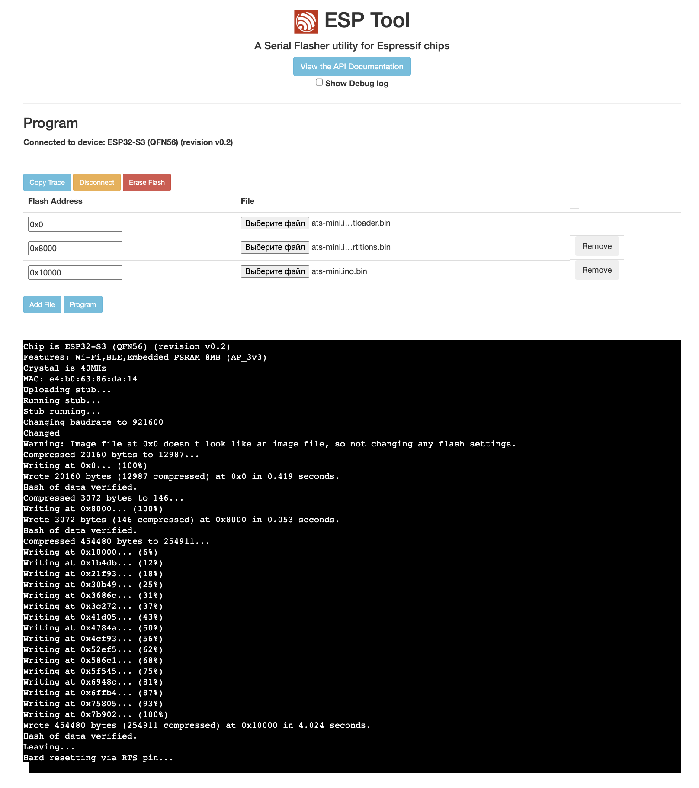
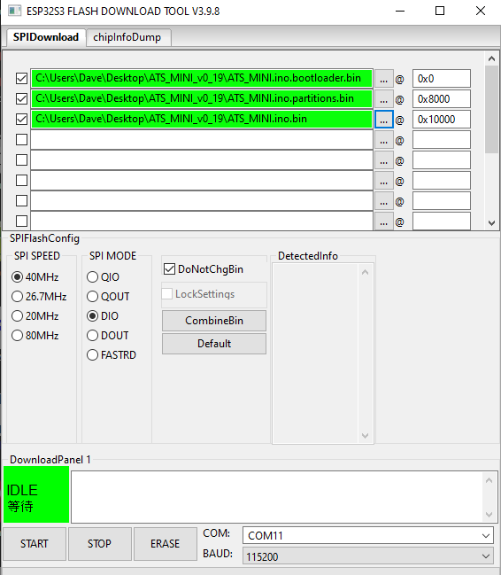

# Flashing the firmware

```{warning}
Flashing the firmware can make your receiver unusable.
```

Before proceeding, please check whether the receiver board has [BOOT & RESET buttons](hardware.md#boot-and-reset-buttons) soldered, which can help to [recover](recovery.md#recovery) it. Also there is a way to [back up](recovery.md#backup) the stock firmware, so you can roll back to it if you want.

## Firmware files

```{hint}
The firmware releases are available on [GitHub](https://github.com/esp32-si4732/ats-mini/releases).
```

A firmware archive contains the following files:

1. `CHANGELOG.md` - a text file that describes what's new in each firmware version
2. `ats-mini.ino.bootloader.bin` - a bootloader (should be flashed at address **`0x0`**)
3. `ats-mini.ino.partitions.bin` - a partition table (should be flashed at address **`0x8000`**)
4. `ats-mini.ino.bin` - a firmware itself (should be flashed at address **`0x10000`**)
5. `ats-mini.ino.merged.bin` - the three previous files combined into one (should be flashed at address **`0x0`**)

So, you need to flash your receiver using **just one** of the following two ways:

- Flash the three files (**2** - `bootloader`, **3** - `partitions`, **4** - `firmware` using the right addresses. The receiver settings might be reset in some versions.

**OR**

- Only flash the last file (**5** - `merged`) using the **`0x0`** address. The receiver settings will be always reset.

## Flash using a web browser

Works on: Windows, macOS, Linux

This is the simplest method, but you need a browser that supports the [Web Serial API](https://developer.mozilla.org/en-US/docs/Web/API/Web_Serial_API). This means Chrome and [some other browsers](https://developer.mozilla.org/en-US/docs/Web/API/Web_Serial_API#browser_compatibility). No, Firefox and Safari can't do it.

```{tip}
On Linux, please make sure that the user account that runs your browser has the [necessary permissions](https://www.reddit.com/r/linuxquestions/comments/vqzev0/browser_serial_port_fails_to_open/) to access the serial port.
```

1. Connect your receiver to a computer using USB and power it on.
2. A new serial port should appear. On Windows check the USB Serial COM port in the Windows Device Manager, on macOS it will look like `/dev/tty.usbmodemXXXX`, on Linux like `/dev/ttyACMX`.
3. Open the following link: <https://espressif.github.io/esptool-js/>
4. Press the `Connect` button and choose the right serial port.
5. Add either the three separate firmware files at the [right addresses](#firmware-files), or the merged one at `0x0`.
6. Press the `Program` button.
7. Wait until the following text will appear in the black serial log window: `Leaving... Hard resetting via RTS pin...`
8. Press the `Disconnect` button.
9. Power off and power on the receiver.
10. Check out the firmware version in Menu -> Settings -> About on the receiver.



## Flash Download Tool

Works on: Windows

1. Download the Expressif [Flash Download Tool](https://docs.espressif.com/projects/esp-test-tools/en/latest/esp32/production_stage/tools/flash_download_tool.html), unpack the archive.
2. Connect your receiver to a computer using USB and power it on.
3. A new serial port should appear, check the USB Serial COM port in the Windows Device Manager.
4. Run the `flash_dowload_tool` executable file.
5. Choose `Chip Type: ESP32-S3`, `WorkMode: Develop`, `LoadMode: UART`.
6. Add either the three separate firmware files at the [right addresses](#firmware-files), or the merged one at `0x0`. Enable the check boxes next to the file bars.
7. Set the COM port and other settings.
8. After checking all information is correct, press the `START` button.
9. Wait until the following text will appear in the black log window: `is stub and send flash finish`
10. Power off and power on the receiver.
11. Check out the firmware version in Menu -> Settings -> About on the receiver.



## esptool.py

Works on: Windows, macOS, Linux

1. Install `uv` (Windows, macOS, Linux) <https://docs.astral.sh/uv/getting-started/installation/>
2. Connect your receiver to a computer using USB and power it on.
3. A new serial port should appear. On Windows check the USB Serial COM port in the Windows Device Manager, on macOS it will look like `/dev/tty.usbmodemXXXX`, on Linux like `/dev/ttyACMX`.
3. Run **just one** of the two following commands (the first one uses three separate firmware files, the second one uses the single merged firmware file):
   ```shell
   uvx --from esptool esptool.py --chip esp32s3 --port SERIAL_PORT --baud 921600 --before default_reset --after hard_reset write_flash  -z --flash_mode keep --flash_freq keep --flash_size keep 0x0 ats-mini.ino.bootloader.bin 0x8000 ats-mini.ino.partitions.bin 0x10000 ats-mini.ino.bin

   # OR

   uvx --from esptool esptool.py --chip esp32s3 --port SERIAL_PORT --baud 921600 --before default_reset --after hard_reset write_flash  -z --flash_mode keep --flash_freq keep --flash_size keep 0x0 ats-mini.ino.merged.bin
   ```
4. Check out the firmware version in Menu -> Settings -> About on the receiver.
